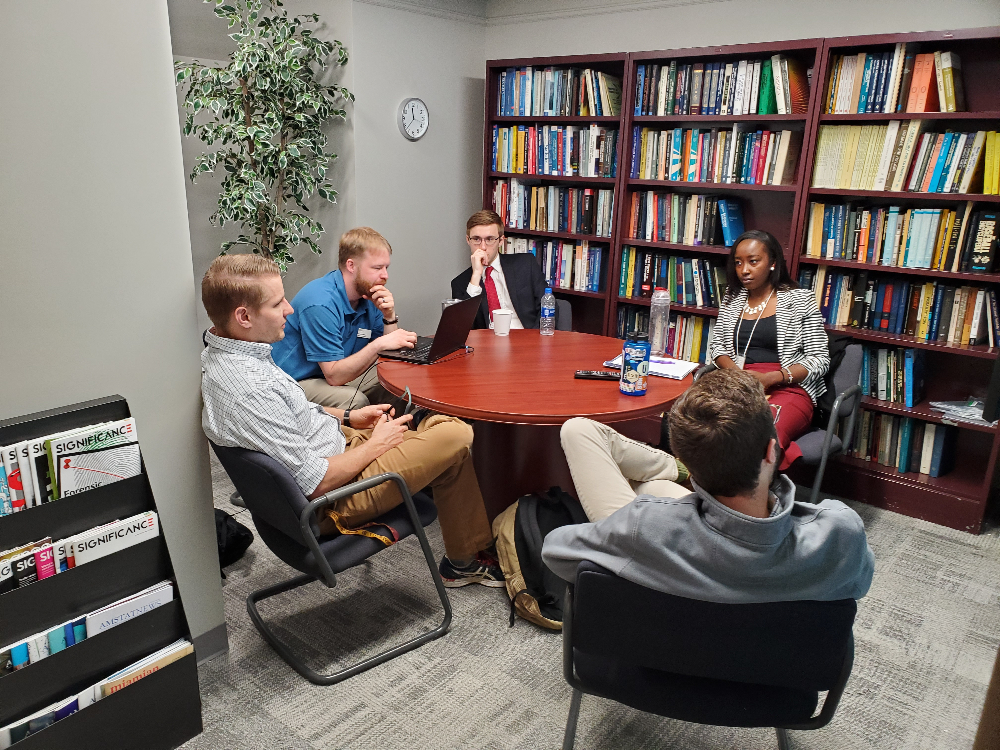

<link rel="stylesheet" href="styles.css" type="text/css">

# Statement

</img>

I regularly work with undergraduate students on independent study research projects.
Many of these projects entail students competing in the Data Expo (a data analysis competition) at the Joint Statistics Meetings however students may perform or assist in the analysis of a collaborative project.

I am also very involved in the local <a href="https://ww2.amstat.org/education/datafest/">DataFest</a> competition hosted by the <a href="https://miamioh.edu/cads/index.html">Center for Analytics & Data Science</a> at Miami University. I have organized the competition, contribute to the data distribution and have mentored many teams over the years.

We have been quite successful over the years in the various competitions, if interested in participating feel free to contact me or one of the current/former students working in the lab. Generally, we recruit students after they have completed foundational work (at least STA 363) but with more advanced courses you can make stronger contributions.

# Current Students & Alumni

Click to expand

* <a href="https://www.linkedin.com/in/emilylmorris/">Emily Morris</a>, c/o 2015 - PhD at University of Michigan (2021), USDA
* <a href="https://www.linkedin.com/in/cody-philips-4517b5100/">Cody Philips</a>, c/o 2017 - Data Scientist at Quotient Technology Inc.
* <a href="https://www.linkedin.com/in/alantatro/">A.J. Tatro</a>, c/o 2017 - Actuarial Assistant at Allstate
* <a href="https://scholars.duke.edu/person/heather.mathews">Heather Mathews</a>, c/o 2017 - PhD Student at Duke University
* <a href="https://www.linkedin.com/in/alec-feeman/">Alec Feeman</a>, c/o 2018 - Senior Data Scientist at LendingTree
* <a href="https://github.com/garretrc">Robert C. Garrett</a>, c/o 2019 - PhD Student at University of Illinois
* <a href="https://www.linkedin.com/in/ritu-narahari-534a8611b/">Ritu Narahari</a>, c/o 2020 - M.S.\ student at Case Western Reserve
* <a href="https://www.austinnar.com/">Austin Nar</a>, c/o 2019 - Data Scientist at 84.51$^\circ$
* Ryan Estep, c/o 2020
* <a href="https://www.linkedin.com/in/daniel-cirkovic-0ab7b2168/">Daniel Cirkovic</a>, c/o 2020 - PhD student at Texas A&M
* <a href="https://www.linkedin.com/in/benjamin-schweitzer-789175144/">Benjamin Schweitzer</a>, c/o 2020 - Associate Data Scientist at Nielsen
* <a href="https://www.linkedin.com/in/tuiyott-alison/">Alison Tuiyott</a>, c/o 2020 - Data Science Associate at JPMorgan Chase & Co.
* Phuong Ho, c/o 2020
* Matthew Snyder, c/o 2021
* <a href="https://www.linkedin.com/in/lydia-carter-oh/">Lydia Carter</a>, c/o 2021 - Current MS Statistics student at Miami
* <a href="https://www.linkedin.com/in/coby-warkentin-650b1a191/">Coby Warkentin</a>

 

# Published Results

* Renwick, William H., Vanni, Michael J., Fisher, T.J., **Morris, Emily L.**, "<a href="https://acsess.onlinelibrary.wiley.com/doi/full/10.2134/jeq2018.04.0162">Stream Nitrogen, Phosphorus, and Sediment Concentrations Show Contrasting Long-term Trends Associated with Agricultural Change</a>", *Journal of Environmental Quality*, 47: 1513-1521, November 2018. (`10.2134/jeq2018.04.0162`)
* **Garrett, Robert C.**, **Nar, Austin**, Fisher, T.J. and Maurer, K.T., "<a href="https://joss.theoj.org/papers/10.21105/joss.01096">ggvoronoi: Voronoi Diagrams and Heatmaps with ggplot2</a>", *Journal of Open Source Software*, 3 (32), 1096, December 2018.  (`10.21105/joss.01096`)
   + R Package: <a href="https://cran.r-project.org/web/packages/ggvoronoi/index.html">ggvoronoi</a>: Voronoi Diagrams and Heatmaps with 'ggplot2'
* **Philips, Cody**, **Garrett, Robert**, **Tatro, A.J.** and Fisher, T.J., "<a href="https://link.springer.com/article/10.1007/s00180-021-01072-9">Crash-Safety Ratings and the True Assessment of Injuries by Vehicle</a>", *Computational Statistics*, 36, 1639–1660 February 2021.   (`10.1007/s00180-021-01072-9`)

# Faculty collaborators

* <a href="http://www.units.miamioh.edu/vannilab/">Mike Vanni</a>
* <a href="https://www.linkedin.com/in/jing-zhang-b6790795/">Jing Zhang</a>
* <a href="https://kmaurer.github.io/">Karsten Maurer</a>
