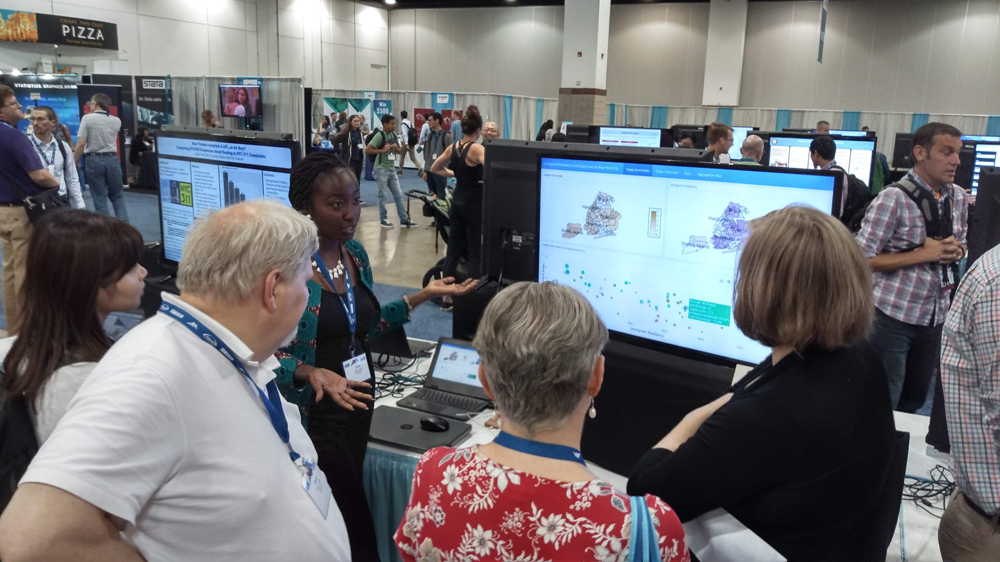
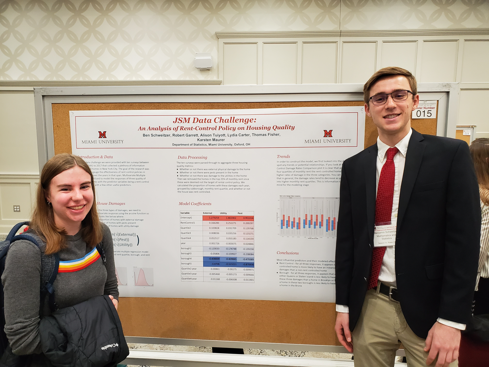

<link rel="stylesheet" href="styles.css" type="text/css">

Students have regularly presented their findings at national and international conferences, as well as the annual <a href="https://www.miamioh.edu/student-research/research-opportunities/urf/index.html">Undergraduate Research Forum</a> held every April at Miami University. 

# National & International Conferences

Click to expand

</img>

* **Philips, Cody**, "<a href="https://ww2.amstat.org/meetings/jsm/2016/onlineprogram/AbstractDetails.cfm?abstractid=319261">Crash-Safety Ratings and the True Assessment of Injuries by Vehicle</a>", 01 August 2016, Joint Statistics Meetings, Chicago, IL
* **Garrett, Robert**, "<a href="https://ww2.amstat.org/meetings/jsm/2017/onlineprogram/AbstractDetails.cfm?abstractid=323964">An Analysis of Consumer Budgeting and the Great Recession</a>", 31 July 2017, Joint Statistics Meetings, Baltimore, MD.  Made the <a href="https://magazine.amstat.org/blog/2017/10/01/garrett_jsm/">AMSTAT News</a>.
* **Philips, Cody**, "<a href="https://ww2.amstat.org/meetings/sdss/2018/onlineprogram/AbstractDetails.cfm?AbstractID=304561">An Analysis of Crash-Safety Ratings and the True Assessment of Injuries by Vehicle</a>", 19 May 2018, Symposium on Data Science & Statistics, Reston, VA
* **Garrett, Robert**, "<a href="https://ww2.amstat.org/meetings/jsm/2018/onlineprogram/AbstractDetails.cfm?abstractid=329784">Assessing Prediction Error in Traditional Weather Forecasts vs. a Data-Centric Approach</a>", 30 July 2018, Joint Statistics Meetings, Vancouver, BC
* **Schweitzer, Benjamin**, "<a href="https://ww2.amstat.org/meetings/jsm/2018/onlineprogram/AbstractDetails.cfm?abstractid=329369">An Analysis on the Accuracy of Weather Forecasts</a>", 30 July 2018, Joint Statistics Meetings, Vancouver, BC
* **Rook, Nicole**, "<a href="https://ww2.amstat.org/meetings/wsds/2018/onlineprogram/AbstractDetails.cfm?AbstractID=304838">A Shiny Way to Explore the Accuracy of Weather Forecast</a>", 19 October 2018, Women in Data Science & Statistics, Cincinnati, OH
* **Cirkovic, Daniel**, "<a href="https://ww2.amstat.org/meetings/jsm/2019/onlineprogram/AbstractDetails.cfm?abstractid=304242">Comparison of Bootstrapping Techniques in Multivariate Time Series</a>", 29 July 2019, Joint Statistics Meetings, Denver, CO
* **Schweitzer, Benjamin**, "<a href="https://ww2.amstat.org/meetings/jsm/2019/onlineprogram/AbstractDetails.cfm?abstractid=304897">An Analysis of Rent-Control Policy on Housing Quality</a>", 28 July 2019, Joint Statistics Meetings, Denver, CO
* **Tuiyott, Alison**, "<a href="https://ww2.amstat.org/meetings/jsm/2019/onlineprogram/AbstractDetails.cfm?abstractid=304592">Immigrant Residency and Happiness in New York City</a>", 28 July 2019, Joint Statistics Meetings, Denver, CO
* **Carter, Lydia**, "<a href="https://ww2.amstat.org/meetings/jsm/2020/onlineprogram/AbstractDetails.cfm?abstractid=312805">An Analysis of Climate Change Impact on Public Opinion</a>", 4 August 2020, Joint Statistics Meetings, Virtual
* **Ho, Phuong**, "<a href="https://ww2.amstat.org/meetings/jsm/2020/onlineprogram/AbstractDetails.cfm?abstractid=312740">Data Expo 2020: Temperature Effect on the United States’ Agriculture</a>", 4 August 2020, Joint Statistics Meetings, Virtual
* **Warkentin, Coby**, "<a href="https://ww2.amstat.org/meetings/jsm/2021/onlineprogram/AbstractDetails.cfm?abstractid=318915">Predicting the Impacts of a Pandemic: An Analysis of the Relationship Between Social Vulnerability and COVID-19 in the United States</a>", 9 August 2021, Joint Statistics Meetings, Virtual
* **Carter, Lydia**, "<a href="https://ww2.amstat.org/meetings/wsds/2021/onlineprogram/AbstractDetails.cfm?AbstractID=309974">Predicting the Impacts of a Pandemic: An Analysis of the Relationship Between Social Vulnerability and COVID-19 in the United States</a>", *scheduled* 7 October 2021, Women in Data Science & Statistics, Virtual
* **Everett, Aly**, "<a href="https://ww2.amstat.org/meetings/jsm/2022/onlineprogram/AbstractDetails.cfm?abstractid=323744">An Analysis on the Impact of Socioeconomic Status on Success in School</a>", 7 August 2022, Joint Statistics Meetings, Washington, D.C.

 

# Undergraduate Research Forum

Click to expand

</img>

* **Morris, Emily L.**, <a href="https://miamioh.edu/_files/documents/research/student-research/OARS_UndergradResearchForum15_accessible_508.pdf">2015 URF</a>, "Modeling and Detecting Changes in Water Quality of a Midwest Watershed."
* **Feeman, Alec**, <a href="https://miamioh.edu/_files/documents/research/student-research/2016_Undergrad_Research_Forum_508.pdf">2016 URF</a>, "Investing Using Short Term Statistical Forecasting", part of the <a href="https://www.miamioh.edu/student-research/research-opportunities/fyre/index.html">FYRE Program</a>
* **Tatro, A.J.**, <a href="https://miamioh.edu/_files/documents/research/student-research/UR_Forum_2017_508.pdf?_ga=2.14773365.2131588518.1630169701-33807195.1582750028">2017 URF</a>, "Bayesian Variable Selection in Time Series Regression with an Application to Ecological Data", co-advised with Jing Zhang.
* **Schweitzer, Benjamin**, <a href="https://miamioh.edu/_files/documents/research/student-research/2018-ur-forum-booklet-508.pdf">2018 URF</a>, "An Analysis on the Accuracy of Weather Forecasts"
* **Garrett, Robert**, <a href="https://www.miamioh.edu/_files/documents/research/student-research/undergrad-research-forum-brochure-2019_508.pdf">2019 URF</a>, "Applications of Voronoi Diagrams in Statistics and Data Science", co-advised with Karsten Maurer
* **Schweitzer, Benjamin**, <a href="https://www.miamioh.edu/_files/documents/research/student-research/undergrad-research-forum-brochure-2019_508.pdf">2019 URF</a>, "An Analysis of Rent-Control Policy on Housing Quality", co-advised with Karsten Maurer
* **Tuiyott, Alison**, <a href="https://www.miamioh.edu/_files/documents/research/student-research/undergrad-research-forum-brochure-2019_508.pdf">2019 URF</a>, "Immigration Generation Status to Quality of Life Over Time", co-advised with Karsten Maurer
* **Carter, Lydia**, <a href="https://sites.miamioh.edu/undergraduate-research-forum/an-analysis-of-climate-change-impact-on-society/">2020 URF</a>, "An Analysis of Climate Change Impact on Society", co-advised with Karsten Maurer
* **Warkentin, Coby** and **Carter, Lydia**, <a href="https://sites.miamioh.edu/undergraduate-research-forum/an-analysis-of-the-relationship-between-social-vulnerability-and-covid-19-impact-in-the-united-states/">2021 URF</a>, "An Analysis of the Relationship Between Social Vulnerability and COVID-19 Impact in the United States"
* **Everett, Aly**, <a href="https://sites.miamioh.edu/undergraduate-research-forum/c24-an-analysis-on-the-impact-of-socioeconomic-status-on-success-in-school/">2022 URF</a>, "An Analysis on the Impact of Socioeconomic Status on Success in School"

 