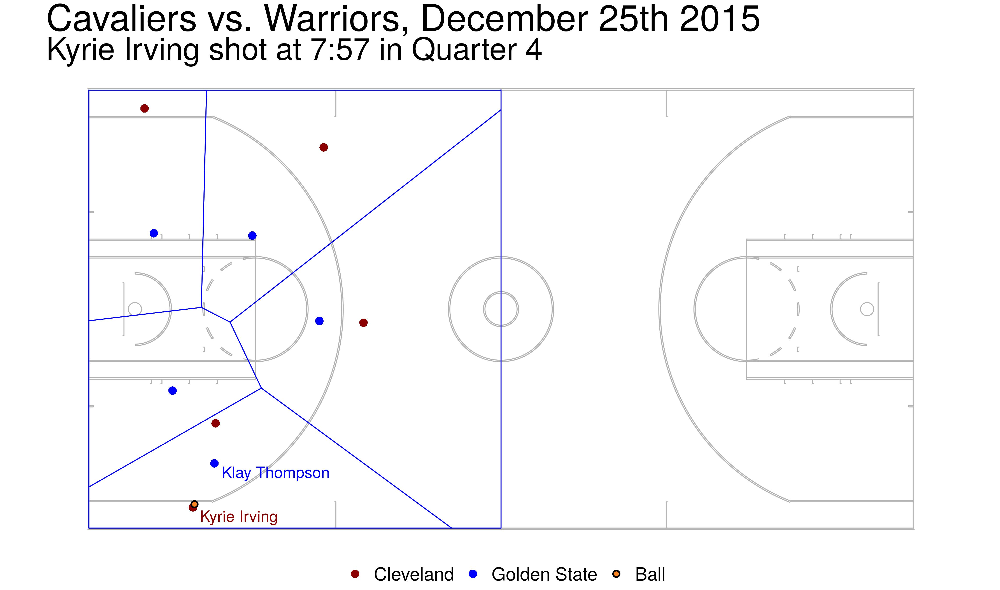
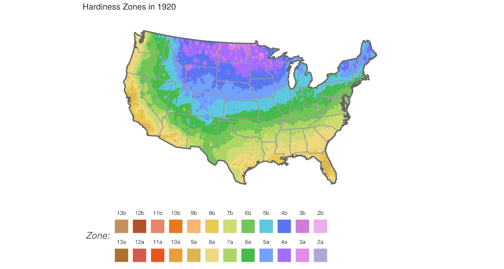

<link rel="stylesheet" href="styles.css" type="text/css">

# Fun with Voronoi diagrams

While participating in the 2018 DataFest competition, students Robert Garrett and Austin Nar hacked together a visual display where <a href="https://en.wikipedia.org/wiki/Voronoi_diagram">Voronoi diagrams</a> (or Dirichlet tesselations) were used to segment the United Stations into regions centered with the 20 largest metropolatian areas. After some strong encourage the two students bundled together the result into the R package <a href="https://cran.r-project.org/web/packages/ggvoronoi/index.html">ggvoronoi</a>. Below are some of the 'fun' visuals we made with this tool.

## Basketball animation

<a href="http://users.miamioh.edu/fishert4/bball2.html" target="_blank" rel="noopener noreferrer"></img></a>

Here we have a still image from an NBA game and a video of an animation. Specifically we

* took NBA player tracking data from the 2015-2016 season (the players and the ball were tracked 24 frames per second) recording the $x,y$ coordinates. 
* We build the optimal Voronoi diagram around each defender on the court -- in a naive way you can think of the area within the Voronoi region as their defensive responsibility.
* The image to the right is from the Cleveland Cavaliers and the Golden State warriors on December 25th, 2015.
* If you click the image, or follow <a href="http://users.miamioh.edu/fishert4/bball2.html" target="_blank" rel="noopener noreferrer">this link</a>, you can see an animation of the game between the San Antonio Spurs & Minnesota Timberwolves on December 15th, 2015.

## Elevation map

The <a href="https://cran.r-project.org/web/packages/ggvoronoi/index.html">ggvoronoi</a> package was used by Ben Schweitzer during the 2018 Data Expo competition and we constructed this 'fun' topological map from the data.

</img>

* The competition entailed looking at the accuracy of weather forecast and Ben was using the <a href="https://www.ncdc.noaa.gov/">National Centers for Environmental Information from NOAA</a> land based weather records as part of his analysis.
* Each weather station in the NOAA dataset has a recorded latitude, longitude and elevation.
* We used the latitude and longitude to build the Voronoi regions.
* Each region is then filled with a color corresponding to the elevation.
* Note this map is not perfect (see Nebraska and all the weather stations reporting a 0 meter elevation) but overall captures the topography of North America.

 
 

# Changing Hardiness Zones in time

As part of the 2020 Data Expo competition, Phuong Ho and Lydia Carter looked at the historic land-station weather data from the <a href="https://www.ncdc.noaa.gov/">National Centers for Environmental Information from NOAA</a>. Specifically our team did the following:

</img>

* For each weather station in the contiguous United States we found the minimum low temperature for each year since 1890.
* For each station we then computed a 30-year "moving average" low temperature; computed over years 1890-1920, 1895-1925, 1900-1930, ...
* The contiguous United States was segmented into 200,000 blocks and an Inverse Distance Linear interpolation was performed on each block to predict that locations average low temperature using the computed 30-year average low temperature of all weather stations as the inputs.
* Hardiness zones were assigned in each 30-year window as defined by the <a href="https://planthardiness.ars.usda.gov/">USDA</a> for each of the 200,000 blocks.
* Maps were rendered for each window and all images were then animated into a gif.

